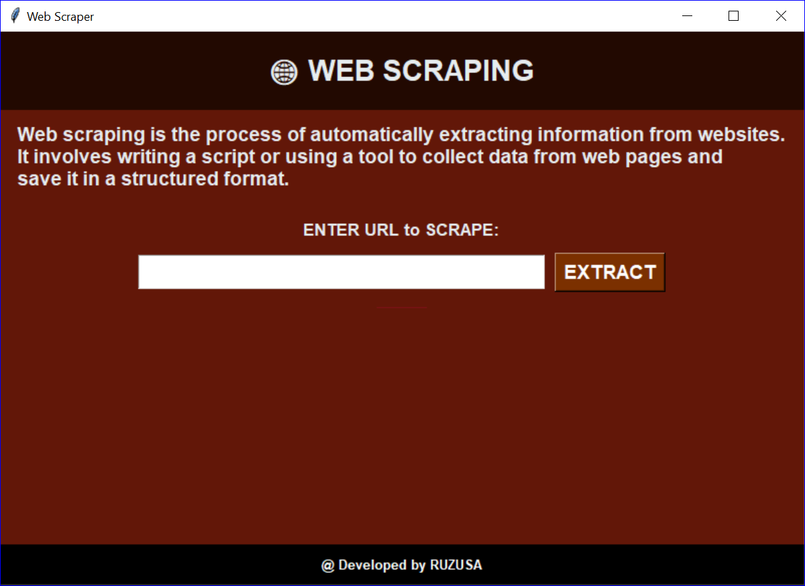

# 🕷️ Web Scraper GUI (Python + Tkinter)

A beginner-friendly, GUI-based Python web scraper that extracts readable text from any public webpage and saves it into a timestamped `.txt` file. Built using `requests`, `BeautifulSoup`, and `Tkinter`.

---

## 📌 Features

- ✅ GUI interface using `Tkinter`
- 🌐 URL input & validation
- 📄 Extracts clean text (no HTML/tags/scripts)
- 💾 Saves data as `data_YYYYMMDD_HHMMSS.txt` in `extracted_data/` folder
- 🧾 Logs scrape history with timestamp in `history.txt`
- 📊 Progress bar for better user experience

---

## 📁 Project Structure

Web-Scraper/
├── PF_PROJECT.py # Main script
├── extracted_data/ # Saved text files
├── history.txt # Log of past URLs scraped
├── screenshot.png # GUI screenshot
└── README.md # Project documentation


---

## 🚀 How to Run

1. Make sure Python 3 is installed
2. Install dependencies (built-in, but just in case):

```bash
pip install requests beautifulsoup4
```

3. Run the script:
   
```bash
PF_PROJECT.py
```

4. Enter a valid URL (starting with http:// or https://)
5. The app will extract and save the text content into the extracted_data/ folder

--- 

## 📸 GUI Preview

Here’s a preview of the app interface:



---

## 👨‍💻 Built By
Ruzusa — Python Automation Beginner
Freelancer on Fiverr | Future Full-Stack Developer 🚀

---

## 💡 Related Projects
- Excel Marks Formatter
- PDF Batch Renamer

--- 

## 📌 Tags
- Python 
- Web Scraping
- GUI
- Tkinter
- Automation
- Beginner Project
- Fiverr
